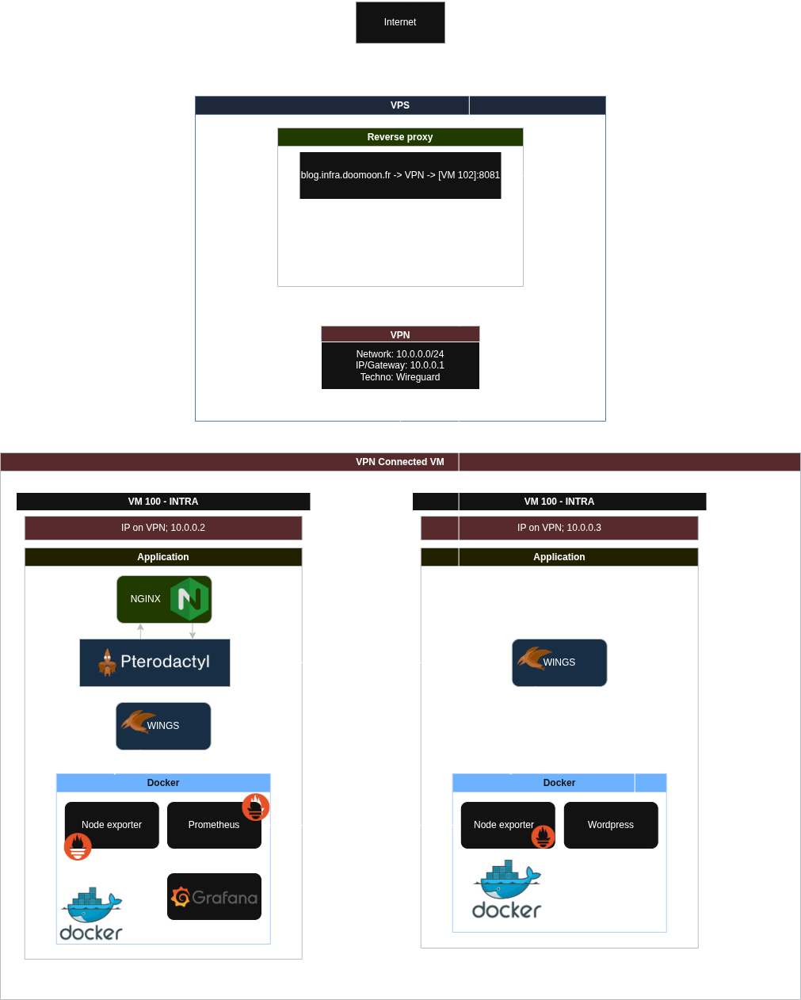

# Infrastructure Project Documentation

## Overview

This document explains the setup and configuration of the infrastructure, which consists of three virtual machines (VMs).

## Table of Contents

1. [Overview](#overview)
    - [Infrastructure Overview](#infrastructure-overview)
    - [Hosts Overview](#hosts-overview)
    - [Domain Name](#domain-name)
2. [VPN Configuration](#vpn-configuration)
3. [Monitoring](#monitoring)
4. [Pterodactyl Setup](#pterodactyl-setup)
5. [Web](#web)
6. [Security Measures](#security-measures)
7. [Best Practices](#best-practices)

---

### Infrastructure Overview


### Hosts Overview

1. **VPS (Real VPS)**

    - **IP/CIDR**: `10.0.0.1/24`
    - **Purpose**: Serves as the central hub for the VPN, linking VMs together and exposing specific ports to the internet.
    - **Services**:
        - **WireGuard VPN**: Documentation available [here](./VPN/docs.md).
        - **Reverse Proxy**: Documentation available [here](./Web/Wordpress.md#2-reverse-proxy).
    - **Host**: This VPS is provided by [RedHeberg.Fr](https://redheberg.Fr).
    - **Ressources**:
      |**CPU** | **RAM** | **Disk** | **Network** |
      |---------|---------|----------|-------------------|
      | 4 vCPU | 6 GB | 60 GB | 10 Gbps (shared) |

2. **VM 1 (Local)**

    - **IP/CIDR**: `10.0.0.2/24`
    - **Purpose**: Acts as an intranet VM connected to the VPN, hosting internal services and applications that are not exposed to the internet.
    - **Services**:
        - **Monitoring**: Refer to the documentation [here](./Monitoring/monitoring.md).
        - **Pterodactyl Panel**: Installed on this VM. Documentation is available [here](./Web/Pterodactyl.md#1-pterodactyl-installation).
        - **Pterodactyl Wings**: Used for managing Docker containers. Documentation can be found [here](./Web/Pterodactyl.md#2-wings-installation).
    - **Host**: This VM is hosted on my Proxmox server at home.
    - **Ressources**:
      |**CPU** | **RAM** | **Disk** | **Network** |
      |---------|---------|----------|-------------------|
      | 2 vCPU | 4 GB | 30 GB | 500 Mbps (shared) |

3. **VM 2 (Local)**
    - **IP/CIDR**: `10.0.0.3`.
    - **Purpose**: Connected to the VPN for remote access. This VM is used for all applications that should be exposed on the internet, with a reverse proxy running on the VPS.
    - **Services**:
        - **Node Exporter (metrics)**: Documentation available [here](./Monitoring/monitoring.md#3-node-exporter-installation).
        - **Pterodactyl Wings**: Installed to manage docker containers. Found the documentation [here](./Web/Pterodactyl.md#2-wings-installation).
        - **WordPress**: Deployed using Pterodactyl. Documentation for WordPress setup is [here](./Web/Wordpress.md)
    - **Host**: This VM is hosted on my Proxmox server at my house
    - **Ressources**:
      |**CPU** | **RAM** | **Disk** | **Network** |
      |---------|---------|----------|-------------------|
      | 2 vCPU | 4 GB | 30 GB | 500 Mbps (shared) |

### Domain Name

For this project, we own the `infra.doomoon.fr` subdomain. We have full administrative access, allowing us to create and manage unlimited subdomains under it. This flexibility enables us to allocate specific subdomains for different services or applications as needed, ensuring a clean and organized structure for external access.
We use `blog.infra.doomoon.fr` on this documentation for hosting a WordPress website.

---

## VPN Configuration

The WireGuard VPN is configured on the VPS to allow secure communication between all VMs. The two local VMs connect to the VPN, enabling access from anywhere as long as the VPN is active. Refer to the [VPN documentation](./VPN/docs.md) for detailed setup instructions.  
You can also find the rationale behind the choice of technologies in the documentation, available [here](./VPN/technicalDocumentation.md#technologies-wireguard).

---

## Monitoring

Monitoring tools are deployed across the infrastructure to ensure optimal performance and health tracking. The intranet VM hosts run monitoring services such as `Grafana` and `Prometheus`, providing centralized oversight of the system. Additionally, Node Exporter is installed on all VPN-connected hosts, enabling detailed metrics collection and monitoring for the entire infrastructure. This setup ensures proactive issue detection and streamlined performance analysis. Refer to the [Monitoring documentation](./Monitoring/monitoring.md) for detailed setup and more information.

---

## Pterodactyl Setup

In this project, we opted to use Pterodactyl for managing our Docker containers. Although Pterodactyl was originally designed for game server management, its open-source nature allows it to run virtually any application that can operate within a Docker container. This flexibility makes it a powerful tool for managing diverse workloads beyond its initial purpose.
Because Pterodactyl allow to manage docker container on many differents host (node) at time, we call it the 'management panel', so it's should not be exposed on internet. This panel is so installed in intra-net.

-   **Panel**: Installed on the VPS with the IP address `10.0.0.2` (intra-net).
-   **Wings**:
    -   Installed on the VM 2 (`10.0.0.2`) to manage internal docker container.
    -   Installed on VM 2 (`10.0.0.3`) to extend server management capabilities and to split internal from external web app.
-   **Nodes**: Here is the node list that can be found on our pterodactyl panel
    | **Node Name** | **Node URL** |
    |---------------|--------------|
    | node-intra | `http://10.0.0.2` |
    | node-extra | `http://10.0.0.3` |

Refer to [Pterodactyl and Wings documentation](./Web/Pterodactyl.md) for more details about setup and [usage](./Web/Pterodactyl.md#3-pterodactyl-usage)

## Web

For this project, we have deployed a WordPress website accessible at `blog.infra.doomoon.fr`. This website is hosted on the external node (`node-extra`) managed through [Pterodactyl](#pterodactyl-setup). By leveraging Pterodactyl's container management capabilities, we ensure a streamlined and efficient deployment process.

The WordPress instance is configured to run securely and efficiently, with the reverse proxy on the VPS handling external traffic. This setup ensures that the website remains accessible while maintaining a secure and organized infrastructure.

For detailed instructions on the WordPress setup and configuration, refer to the [WordPress documentation](./Web/Wordpress.md).

---

## Security Measures

This security measures was apply on all host

-   **VPN**: The WireGuard VPN is implemented to establish a secure and encrypted communication channel between all VMs. It creates a virtual private network, enabling remote access to the infrastructure from anywhere while ensuring data confidentiality and integrity. Find documentation [here](./VPN/docs.md)
-   **Firewall Rules**: Configured to restrict access to essential services only.
-   **Regular Updates**: All software and operating systems are kept up-to-date using automated cron jobs to ensure security and stability.
-   **Monitoring**: Continuous monitoring is implemented using Grafana and Prometheus to track system performance and detect issues proactively. Find documentation [here](./Monitoring/monitoring.md)
-   **SSH**: Here is all we have do to securise SSH connection
    -   **Disable Root Login**: Ensure that the root user cannot log in directly via SSH.
    -   **Change Default SSH Port**: Use a non-standard port for SSH to reduce the risk of automated attacks (1501).
    -   **Limit SSH Connections**: Configure `sshd` to limit the number of simultaneous connections and prevent brute-force attacks.
    -   **Use Fail2Ban**: Install and configure Fail2Ban to block IP addresses after a certain number of failed login attempts.

Refer to the [Security documentation](./Security/Security.md) for detailed security practices and configurations.

---

## Best Practices

-   **Documentation**: Ensure all configurations, setups, and processes are thoroughly documented for easy reference and onboarding of new team members.
-   **Network Segmentation**: Separate internal and external services using a VPN and reverse proxy to enhance security and reduce attack surfaces.
-   **Access Control**: Implement strict access controls, such as using VPN for internal services and limiting public exposure to only necessary services through the reverse proxy.
-   **Monitoring**: Deploy monitoring tools like Prometheus and Grafana to track system health and set up alerts for anomalies or failures.
-   **Firewall Rules**: Configure firewalls to allow only necessary traffic, blocking unauthorized access to internal and external servers.
-   **Regular Updates**: Keep all software, operating systems, and dependencies up-to-date to mitigate vulnerabilities.
-   **Secure Communication**: Use encrypted protocols (e.g., HTTPS, SSH, VPN) for all communications to protect data in transit.
-   **Reverse Proxy Configuration**: Properly configure the reverse proxy to handle SSL termination, caching, and routing efficiently.
-   **Scalability**: Design the infrastructure to allow easy addition of new services, VMs, or nodes as the project grows (with Pterodactyl).
-   **User Authentication**: Use strong authentication mechanisms, such as SSH keys and two-factor authentication, for accessing servers and panel.

--- 
# Issue documentation:
The following section is included in this documentation as it was explicitly required by the project guidelines. However, it does not serve as a traditional documentation of the infrastructure setup or configuration. Instead, it provides an overview of the challenges encountered during the implementation process and the solutions applied to resolve them. This inclusion aims to offer insights into the troubleshooting steps and decisions made throughout the project.

## Problem: **Wordpress does not install**.

### Description:

The egg to install web applications in docker containers via pterodactyl uses the wget command to install the wordpress archive, but the server returns an error with a status code 434 meaning that the TLS version used is invalid.
In addition, the server was not installed correctly, as PHP could not be executed due to the non-existence of the folder in which the socket is supposed to be created.

### Solution:

To correct the problem, we've modified the installation script to use curl instead of wget.
First of all, we need to install curl, because the image used for installation, the alpine image, is a very light linux image with the minimum packet installed, so we first need to install curl with the following command


```
apk --update add curl
```

This command installs curl while updating the list of packets.
We can now replace the condition and the block of code used to install wordpress with the following code:

```
if [ "${WORDPRESS}" == "true" ] || [ "${WORDPRESS}" == "1" ]; then
    echo -e "Installing wordpress"
    cd /mnt/server/webroot
    curl -LO http://wordpress.org/latest.tar.gz
    tar xzf latest.tar.gz
   mv wordpress/* .
   rm -rf wordpress latest.tar.gz
   echo -e "Install complete go to http://ip:port/wp-admin "
   exit 0
fi
```

To solve the second folder problem, we need to add the following line:

```
mkdir /mnt/server/tmp /mnt/server/logs
```

This command creates the `tmp` and `logs` folders on the server. The `logs` folder is necessary for nginx, which causes an error and stops working if you don't put it there.


## Problem: **Packets were not sent because of the MTU.

### Description:

The network interface defined by wings to configure the network on docker was 1500. This wouldn't have been a problem in conventional conditions, as the machine's default MTU is 1500. However, in our case, this is problematic because the machine is connected to a VPN, which uses an MTU of 1420. Of course, all traffic must pass through the VPN, so the 1500 Byte packets were blocked from being sent by the VPN.
The VPN has a lower MTU (1420) to guarantee security, allowing it to add data to each packet to secure them (encapsulation).


### Solution:

We had to reduce the MTU of the docker network interface by adding the following content to the `/etc/docker/daemon.json` file:

```
{
  "mtu": 1392
}
```

This ensures that docker will not send packets larger than 1392 bytes from its virtual networks.
However, this is not enough, as pterodactyl with wings creates a dedicated virtual network, named 'pterodactyl_nw'.
We therefore had to modify the wings configuration file on the server, setting the MTU value to `1392` in the file
/etc/pterodactyl/config.yml` file. Here's a command that would make the change for you:

```
sed -i 's/network_mtu: 1500/network_mtu: 1392/' /etc/pterodactyl/config.yml
```

Then remove the docker network with the following command:

```
docker network rm pterodactyl_nw
```

and finally, you need to restart the wings to recreate the network with the correct values:

```
systemctl restart wings
```

Here are all the commands to be executed grouped together:

```
echo '{"mtu": 1392}' > /etc/docker/daemon.json
sed -i 's/network_mtu: 1500/network_mtu: 1392/' /etc/pterodactyl/config.yml
docker network rm pterodactyl_nw
systemctl restart wings

```

### Infos:

Wireguard uses an MTU that is 80 bytes lower than that of the main network interface. This is due to the fact that it encapsulates packets and adds an overhead (headers) containing protocol headers and its own headers, so it corresponds to around 60 bytes. The extra 20 bytes are used in the case of ipv6, which includes an additional overhead of 20 bytes.  
The MTU of 1392 corresponds to an additional header, as we noticed that the size of the packets we wanted to send was always increased by 28. When we use the `ping` command with the `-s 1420` option, to send packets of 1420 bytes, we see that the packets are not sent because of the MTU, and that the size of the packets sent is 1448. This represents a difference of 28 bytes. And so, to ensure that the packets can get through, we've limited the MTU to 1392 (1420-28).


```
root@VM-Extra:~# ping -M do -s 1400 8.8.8.8
PING 8.8.8.8 (8.8.8.8) 1400(1428) bytes of data.
ping: local error: message too long, mtu=1420
```

## Problem: **Nested virtualization was not enabled**.

### Description:

When setting up the infrastructure, we encountered a problem where the virtual machines (VMs), which used `LXC` (for `Linux Container`) technology, couldn't do virtualization. This was due to the fact that nested virtualization was not enabled in the configuration of VMs on Proxmox.

Nested virtualization is essential to enable a VM to use technologies such as Docker, which requires virtualization access.


### Solution:

Pour résoudre ce problème, nous avons activé la virtualisation imbriquée sur Proxmox. Voici comment faire:

- Make sure your processor supports it.
- Make sure you have access to the VM's host (proxmox).
- Enable nested virtualization in the LXC container configuration file located in `/etc/pve/lxc/<CTID>.conf` and add the following line:
    ```
    features: nesting=1
    ```
- Restart the relevant container to apply the changes, either with the Proxmox GUI, or with the following command:
    ```shell
    pct reboot <CTID>
    ```
