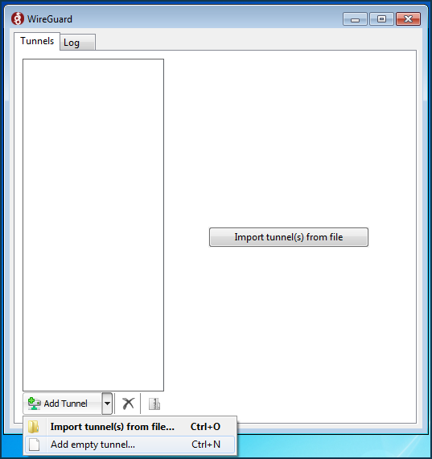
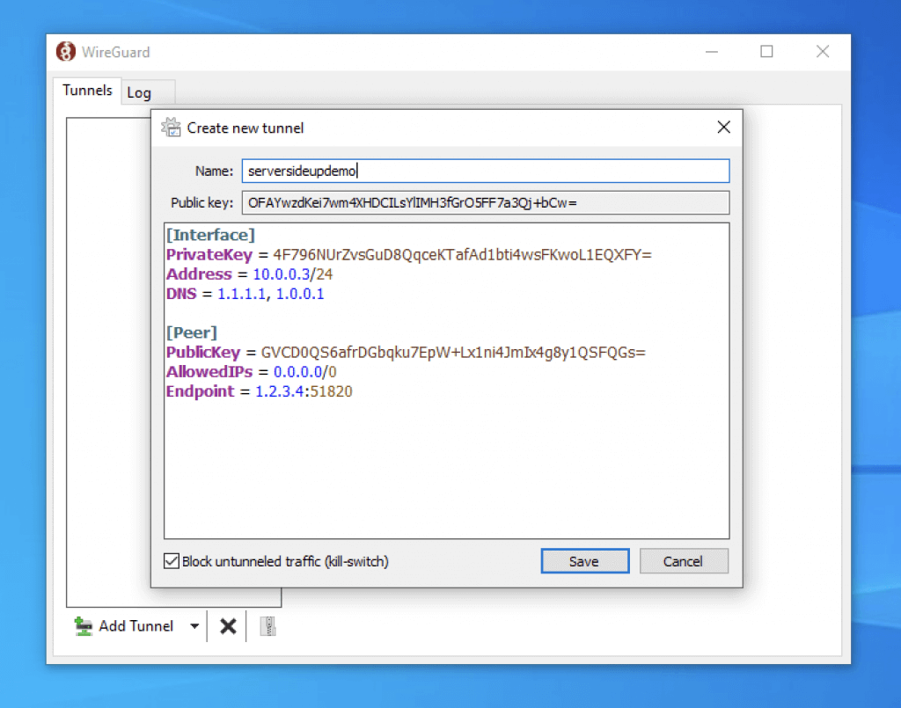
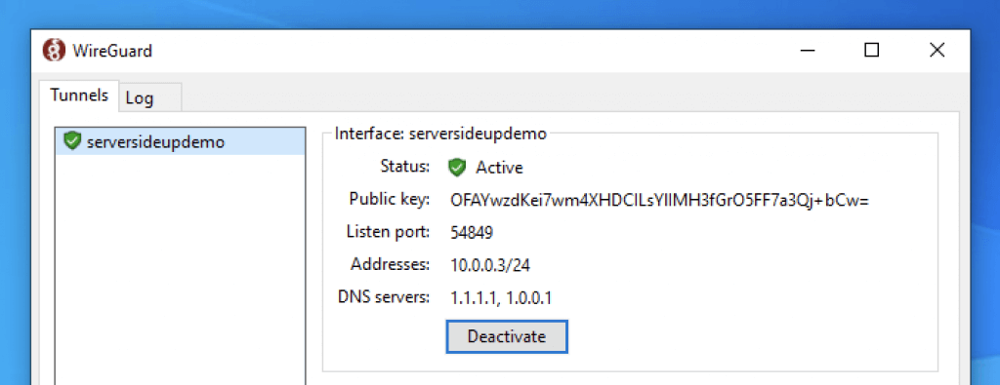

# User documentation
## Table of Contents
- [User documentation](#user-documentation)
  - [Introduction](#introduction)
  - [Installation](#installation)
    - [Windows/MacOs](#windowsmacos)
    - [Linux](#linux)
    - [Mobile platform](#mobile-platform)
  - [Configuration](#configuration)
    - [Windows/MacOs](#windowsmacos-1)
    - [Linux](#linux-1)
    - [Mobile device](#mobile-device)


## Introduction
Here you will learn how to install and configure wireguard on the client side. <br>
Before continue to the client installation and configuration process, ensure you have a client configuration either write by hand or generated by this [script](./wg-add-.sh) (check technical [documentation](./technicalDocumentation.md#step-4-add-client) on how to add client to the server for futher details)


## Installation
Wireguard installation depends of your operating system.
#### Windows/MacOs:
To install wireguard on windows, please download the executable on the [official wireguard website](https://www.wireguard.com/install/)

#### Linux:
Please use your package manager to install wireguard packet. This doc will use the most common one `apt`.
To install wireguard on linux. Please also ensure your system is update (`apt update; apt upgrade`) and run the following command:
```
apt install wireguard -y
```
Sometimes wireguard can't start because of a missing packet, to install it and avoid this error, please install it using the following command
```
apt install -y resolvconf
```
#### Mobile platform:
For all mobile platform, you will found wireguard app on the playstore/app store.
You can find the link that refer to the app on your application shop on the [official wireguard website](https://www.wireguard.com/install/)

## Configuration
The installation also depends of your operating system.
#### Windows/MacOs:
On the GUI, create a new empty tunnel
 <br>
Now copy and paster your configuration inside of the configuration file editor and name your tunnel
 <br>
You can now save and start the tunnel
This should look like this:   
**Congratulations! Your are now connected to the VPN**

#### Linux
To configure wireguard on linux, you need to create a file at `/etc/wireguard`. you can name it like you want at least if it end by '.conf'
Paste your wireguard configuration inside this file.
You can now start it using the following command:
```
wg-quick up <file name>
```
The '\<file name>' should correspond to the name you give to the file containing your wireguard configuration without the '.conf'. <br>
If you want the VPN to automatically start at boot up, you can enable it on systemctl using the following command:
```
systemctl enable --now wg-quick@<file name>
```
Same as before for '\<file name>'!  
**Congratulations! Your are now connected to the VPN**

#### Mobile device
On mobile device, i recommend you to scan the qr code generated by the script that allow to generate client configuration. 
To scan a qr code, open the wireguard app, click on the '+' button and select 'Import from qr code'. <br>
Else you can re-write your configuration file by hand on your mobile device. <br>
Now you should see the VPN tunnel in the list and should be able to start it by clicking on it.  
**Congratulations! Your are now connected to the VPN**
